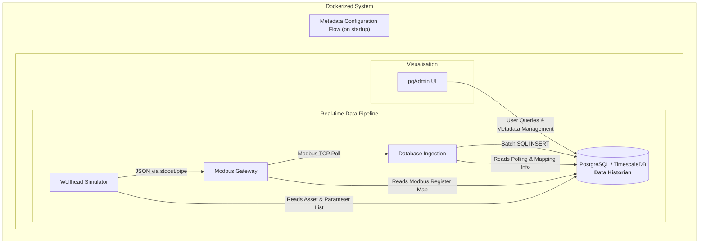

# Industry 4.0 Wellhead Monitoring System Simulation


This project is a complete, containerised simulation of a modern industrial data acquisition and monitoring system for oil and gas wellheads. It demonstrates key Industry 4.0 principles, including metadata-driven configuration, scalable time-series data storage, and real-time, rule-based alarm generation.

The entire system is orchestrated with Docker Compose, allowing for a one-command setup and execution.

## The Problem Solved

In traditional industrial environments, monitoring systems are often rigid. Adding a new piece of equipment or changing a sensor requires manual code changes, reconfiguration of communication servers, and updates to database schemas. This process is slow, error-prone, and does not scale efficiently.

This project solves that problem by implementing a metadata-driven architecture. Instead of hardcoding configuration, the entire system, from the simulator to the data ingestion service, configures itself on startup by querying a central database. This creates a flexible and dynamic system where:

Adding a new wellhead is as simple as adding a new row to a database table.

Changing a Modbus address is a simple UPDATE query.

Defining new alarm rules can be done on the fly without restarting any services.

This approach dramatically reduces maintenance overhead and allows the system to scale seamlessly from a dozen wellheads to thousands.

## System Architecture

The application is composed of four main services that communicate within a Docker network. The data flows in a single, robust pipeline from simulation to storage and analysis.



 #### Wellhead Simulator: Simulates data for 12 wellheads, each with 18 parameters. It first queries the database to learn which wellheads and parameters it needs to simulate.

#### Modbus Gateway: Reads the simulated data and maps it to a Modbus TCP server's register addresses, which are also defined in the database.

#### Database Ingestion: Polls the Modbus Gateway, reads the register values, and inserts them into a TimescaleDB hypertable for efficient time-series storage.

#### PostgreSQL + TimescaleDB: The central nervous system. It stores all asset metadata, configuration, time-series readings, and alarm events. A powerful trigger automatically processes incoming data to check for alarm conditions.

#### pgAdmin: A web-based UI for visualising the database schema, querying live data, and managing the system's metadata.

## The Data Model

The system's flexibility is built upon a comprehensive relational data model. This model separates asset hierarchy, parameter definitions, time-series data, and alarm logic.


##  Getting Started

Follow these steps to get the entire system running on your local machine.

### Prerequisites

Docker

Docker Compose

### 1. Configuration

The project uses a .env file to manage configuration and secrets. Create a file named .env in the root of the project and paste the following content:


```env
# PostgreSQL/TimescaleDB Configuration
POSTGRES_USER=admin
POSTGRES_PASSWORD=supersecretpassword
POSTGRES_DB=wellhead_data
POSTGRES_HOST=db
POSTGRES_PORT=5432

MODBUS_HOST=modbus
MODBUS_PORT=5020

# pgAdmin Configuration
PGADMIN_DEFAULT_EMAIL=admin@example.com
PGADMIN_DEFAULT_PASSWORD=admin
```

## 2. Build and Run
Start docker
Open a terminal in the project's root directory and execute the following command:
```bash
docker compose up --build
```


This command will:

Build the custom Python Docker image.

Pull the official Postgres/TimescaleDB and pgAdmin images.

Create and start all five containers.

Establish a network for the containers to communicate.

You will see logs from all services streaming in your terminal.

## 3. Accessing the System

Modbus Server: Accessible on localhost:5020.

PostgreSQL Database: Accessible on localhost:5432.

pgAdmin Web UI: Accessible at http://localhost:5050.

## 4. Setting up pgAdmin

Navigate to http://localhost:5050 in your browser.

Log in using the credentials from your .env file (admin@example.com / admin).

Click "Add New Server".

In the "General" tab, give it a name (e.g., "Wellhead DB").

In the "Connection" tab, use the following details. This is crucial as pgAdmin is inside the Docker network.

Host Name/Address: db

Port: 5432

Maintenance database: wellhead_data

Username: admin (from .env)

Password: supersecretpassword (from .env)

Click "Save".

You can now browse the database, view the schema created by init.sql, and run queries like SELECT * FROM parameterReading ORDER BY timestamp_utc DESC; to see the data flowing in.

## Project Components Deep Dive

Here is a breakdown of each file and its role in the system.

File	Role	Key Responsibilities
docker-compose.yml:	Orchestrator.	Defines all services (db, simulator, modbus, ingestion, pgadmin), their dependencies, networks, and environment variables.
Dockerfile:	Image Builder.	Creates a single, reusable Python image containing all necessary dependencies (pymodbus, psycopg2) for the application services.
init.sql:	System Brain,	the most critical file. It defines the entire database schema and, crucially, seeds the database with the initial metadata for all 12 wellheads, 18 parameters, their Modbus mappings, and alarm rules.
wellhead_simulator.py:	Data Source.	On startup, it queries the DB to get a list of wellheads and their parameters. Generates randomised data within normal operating ranges and prints it to stdout as JSON.
modbus_gateway.py:	Protocol Server.	Queries the DB for the deviceParameterMapping table. It launches the simulator as a subprocess, reads its JSON output, and uses the mapping to populate its Modbus registers with the correct data.
database_ingestion.py:	Data Historian.	Queries the DB for the same mapping. It acts as a Modbus client, polls the gateway every 30 seconds, decodes the data, and performs an efficient batch INSERT into the parameterReading hypertable.
.env:	Configuration	Stores secrets and environment-specific settings, keeping them separate from the application code and out of version control.
requirements.txt:	Dependencies. Lists the Python packages required for the application, used by the Dockerfile during the image build process.
Future Enhancements

Web Dashboard: Add a Grafana or custom web dashboard service to visualise the time-series data and active alarms.

MQTT Protocol: Implement an MQTT broker and update services to publish/subscribe, a common pattern in IoT architectures.

Advanced Analytics: Create more tables for metrics/derivedValue and write SQL functions to calculate hourly averages, uptime, etc.

CI/CD Pipeline: Implement a CI/CD pipeline using GitHub Actions to automatically build, test, and deploy the Docker containers.
