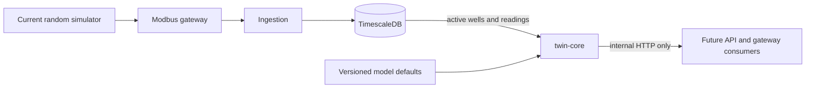

# Milestone 4: Twin-Core Service Design

## Purpose

Milestone 4 creates the service boundary for the future wellhead model. It does
not yet calculate pressure, flow, temperature, or degradation. Those equations
belong to Milestone 5. The existing simulator remains the telemetry source until
Milestone 6 changes the Modbus gateway.

This distinction matters. A service tick is evidence that the process ran its
scheduler. It is not evidence that a physical model advanced.

## What this milestone delivers

- A separate Python container named `twin-core` on the private Compose network.
- Health, readiness, and Prometheus metrics endpoints.
- Typed lifecycle state for each active database wellhead.
- A one-second fixed-step scheduler with bounded catch-up and skipped-tick metrics.
- Versioned synthetic parameter defaults with units, bounds, and strict validation.
- A typed source boundary for later per-well database overrides.
- Read-only state and latest-telemetry HTTP endpoints.
- A database role limited to reading the asset and historian tables.
- Tests for time handling, validation, source quality, and the HTTP boundary.

The service has no control, forecast, scenario, or database write endpoint.
The public API and dashboard do not call it in this milestone.

## System boundary



The service reads active wellhead identifiers from `wellhead`. It reads the
latest historian value for each active parameter mapping. It does not read
Modbus registers. The existing Modbus path is unchanged.

The internal HTTP listener has no published host port. Other containers on
the Compose network can call it at `http://twin-core:8000`. Only the database
role created for this service can be used by its container.

## State and model honesty

A `WellheadState` carries the wellhead identifier, model version, lifecycle
status, reason, tick count, and last service tick time. It also has a typed
`ProcessState` slot for future physical outputs. That slot is `null` throughout
Milestone 4.

The state endpoint returns `status: unavailable` and
`reason: model_not_implemented` while the model is absent. A tick updates
`tickIndex` and `lastTickAt`. It never sets `simulatedAt` or a physical value.

A bad per-well parameter set gives that well
`reason: invalid_parameters`. Readiness fails while any active well has
invalid model parameters. No invalid override silently falls back to a default.

## Fixed-step logic

The scheduler uses monotonic time so wall-clock changes cannot move its
deadlines. The model timestep is one second, as decided in ADR 0020.

```text
due = max(0, floor((now - next_due) / interval) + 1)
run = min(due, max_catchup_steps)
skipped = due - run
next_due = next_due + due * interval
```

`now` and `next_due` are monotonic seconds. `interval` is one second.
`max_catchup_steps` is five by default. `due`, `run`, and `skipped` count
individual ticks.

For example, if eleven ticks are due, the service runs five and records six
skipped ticks. It does not apply one eleven-second model update. The skipped
count and scheduler lag are exported as metrics and logged.

ADR 0020 also names five-second telemetry emission and 30-second state
snapshots. Neither happens yet. Emitting telemetry without equations would
claim a model output that does not exist. The snapshot table is Milestone 7
work.

## Parameters and units

`twin_core/model_defaults.json` is the single version-controlled source for
the 16 synthetic defaults accepted in ADR 0023. Each entry has a description,
unit, default value, valid range, live-change flag, and restart requirement.
These are demonstration values, not field-calibrated settings.

Parameter loading follows ADR 0021:

1. Load version-controlled defaults.
2. Apply validated environment JSON overrides, if present.
3. Apply validated per-well overrides from a source interface, when available.

Unknown keys, booleans, non-finite numbers, and values outside declared bounds
are rejected. Global JSON values use each parameter's declared unit. A per-well
override also carries its stored unit and source; a unit mismatch is rejected.
The per-well database table and its adapter arrive with Milestone 7. The
interface and precedence exist now so later work does not change model logic.

The planned internal API used Celsius while existing wellhead temperature
readings and ADR 0023 use Fahrenheit. The implemented contract uses Fahrenheit
for the future physical state. Current telemetry keeps each parameter's
`canonical_unit` from the historian.

## Latest telemetry

`GET /wellheads/{id}/latest-telemetry` reads the latest stored value for each
active parameter mapping. These values still come from the existing random
simulator through Modbus and ingestion. The response says
`modelGenerated: false` and names that source.

Each reading includes its source timestamp, historian insertion timestamp,
unit, age, and quality. Missing values remain `null`. A reading older than the
configured freshness limit (three telemetry intervals by default) is stale. A timestamp more than five seconds in the
future is marked as clock skew. A non-finite value is marked invalid. The
response also states whether every mapped parameter has a non-null value.

The endpoint does not claim that values form one atomic batch. The database
query uses a new index on mapping identifier and descending timestamp.

## Startup, failure, and recovery

The HTTP server starts first. `/health` shows that the process is alive.
`/ready` remains unavailable until active wells load and the tick loop runs.
The database read has a three-second connection timeout and a three-second
statement timeout.

If the database is offline or slow, the service keeps liveness but fails
readiness. Fleet refresh retries after five seconds. A failed latest-telemetry
read returns 503 without exposing database details. At most eight telemetry
reads may use the database at once. Further requests return a clear 503 and
increment a rejection metric. If active wells are empty, readiness also fails.

The service refreshes active wellheads every 30 seconds. Removing an asset
removes it from current in-memory state. It does not delete historian data.
On restart, lifecycle tick counts start again. Physical recovery from durable
snapshots is deferred to Milestone 7, as recorded in ADRs 0012 and 0022.

A stopped or delayed process does not invent missed model history. The bounded
scheduler records skipped time. SIGTERM requests a clean loop exit, closes the
HTTP listener, and lets Docker stop the container.

## Access and observability

The migrator creates a separate database login for twin-core. It grants SELECT
on `wellhead`, `deviceParameterMapping`, `parameterType`, and
`parameterReading`. PostgreSQL 14 also grants schema creation and temporary
table creation to `PUBLIC` by default. The migrator removes those broad grants
so the reader cannot create database objects. The twin-core sets its database
transactions to read-only as a second guard. Its password is supplied through
local environment configuration and is never logged.

The HTTP API is read-only and private to the Compose network. It has no
application authentication in this milestone, so future write endpoints must
add service authentication before they are exposed. Writes currently return
405. Responses use JSON, explicit content length, `no-store`, and
`nosniff` headers. Errors contain stable codes rather than database messages.

Logs are JSON lines. Metrics include completed ticks, skipped ticks, scheduler
lag, active wells, invalid parameter sets, database read errors, and readiness.
Metric labels have a fixed small set of values.

## Alternatives considered

A framework such as FastAPI would provide automatic request validation and
routing. The current internal surface has five GET paths and no request bodies.
A small standard-library server matches existing Python services and avoids
new dependencies. Routing is kept in one module so it can be replaced if the
control API later needs a larger surface.

The service could copy current random readings into model state. That would
make the state endpoint appear complete before a physical model exists. The
chosen design keeps current telemetry and model state separate.

The service could write placeholder snapshots now. Those would contain no
physical state and would confuse recovery. Snapshot storage is left to the
persistence milestone.

## Acceptance checks

- All Python Ruff, formatting, strict mypy, and pytest checks pass.
- OpenAPI validation and the prose check pass.
- Compose builds the new image and the migrator applies the index.
- The twin-core becomes healthy with the demo fleet.
- Its state reports an unavailable process and no physical values.
- Its telemetry response identifies the current simulator and reports
  timestamps, freshness, and completeness.
- The database role can read its four granted tables and cannot write them.
- The existing simulator, gateway, ingestion, API, and dashboard remain healthy.

## Verification on 2026-09-29

Ruff lint and formatting, strict mypy, 93 Python tests, OpenAPI validation,
and the prose check passed. The running stack loaded 12 active wellheads.
Its state endpoint returned no process values. Its telemetry endpoint returned
18 mapped readings and identified the existing simulator as their source.

The database role could read the required tables. It could not insert into
`wellhead`, read `users`, create in `public`, or create temporary tables.
The existing gateway, ingestion, API, and dashboard containers stayed healthy.

The first isolated `docker compose up -d --build` attempt stopped before
containers started when Docker Buildx lost its daemon connection. After Docker
was restarted, each image built separately. The isolated stack then started
with a newly created database volume. The migrator exited with code 0, all six
long-running services became healthy, and the public API and twin-core
readiness endpoints returned HTTP 200. Twin-core reported 12 active wellheads.
For wellhead 1, state stayed unavailable with `process: null`; telemetry
contained all 18 mapped readings, reported fresh quality, and identified the
existing simulator as its source. The fresh database role allowed SELECT on
`wellhead` but denied INSERT there, SELECT on `users`, schema CREATE, and
database TEMPORARY. The isolated test volume was removed, and the original
stack was restored against its preserved volume.

## Later handoff, 2026-09-30

Milestone 5 filled the `ProcessState` slot with deterministic one-second model
values. Milestone 6 now publishes a complete running fleet through the internal
`GET /model-snapshot` endpoint. The gateway validates that snapshot before it
updates Modbus registers, and ingestion stores source-labelled readings. The
original Milestone 4 sections above describe the service at its first release.
See the [Milestone 5 design](twin-core-milestone-5.md),
[reference-well equations](reference-well-physics.md), and
[Milestone 6 design](twin-core-milestone-6.md) for the current handoff.
